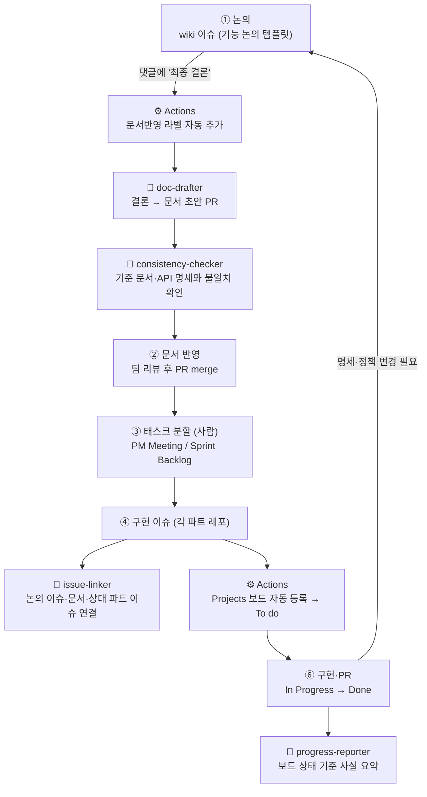

# AI 에이전트 운영 구조

#76에서 합의한 작업 흐름을 AI 에이전트가 어떤 역할로 돕는지 정리한다. 여기서 "에이전트"는 별도 서버나 봇이 아니라, 팀원이 Claude·Codex 같은 AI 도구에 **역할 지침 파일 하나를 지정해 실행하는 작업 단위**다. 반복적이고 판단이 필요 없는 부분만 GitHub Actions로 자동화한다.

## 전체 흐름



🤖는 사람이 실행하는 AI 에이전트, ⚙️는 GitHub Actions 자동화, 나머지는 사람의 작업이다.

## 에이전트 목록

| 에이전트 | 언제 실행 | 입력 | 출력 | 지침 |
|---|---|---|---|---|
| doc-drafter | 논의 이슈에 `문서반영` 라벨이 붙었을 때 | 논의 이슈 번호 | 결정 모음·기준 문서 수정 PR 초안 | [doc-drafter.md](doc-drafter.md) |
| consistency-checker | 문서 반영 PR 리뷰 전, 또는 명세 동기화 후 | PR 또는 변경 문서 | 불일치 목록 (PR 댓글) | [consistency-checker.md](consistency-checker.md) |
| issue-linker | 파트 레포에 구현 이슈를 만든 직후 | 구현 이슈 URL | 관련 논의 이슈·문서 절·상대 파트 이슈 링크 (이슈 댓글) | [issue-linker.md](issue-linker.md) |
| progress-reporter | PM Meeting·Sprint Review 전 | 스프린트 이름 또는 기간 | 보드 상태별 사실 요약 (회의 이슈 댓글 초안) | [progress-reporter.md](progress-reporter.md) |

## 실행 방법

1. wiki 레포와 작업 레포를 나란히 클론하고 최신 `main`을 받는다.
2. AI 도구에서 wiki 레포 루트를 열거나 작업 레포에서 `../KTB4-5th-wiki`를 읽을 수 있게 한다.
3. 아래처럼 요청한다.

```text
KTB4-5th-wiki/AGENTS.md와 docs/agents/doc-drafter.md를 읽고,
wiki 이슈 #33의 최종 결론을 문서 반영 PR 초안으로 만들어줘.
```

GitHub에 쓰는 작업(댓글·PR 생성)은 도구에 GitHub 권한이 있을 때만 하고, 없으면 붙여 넣을 본문을 출력한다.

## 공통 규칙

모든 에이전트는 [AGENTS.md](../../AGENTS.md)의 공통 원칙과 아래를 따른다.

- **판단하지 않는다.** 이슈 분할, 일정·담당자 지정, 정책 선택, 우선순위 결정은 하지 않는다.
- **직접 반영하지 않는다.** `main` push, PR merge, 이슈 close, 라벨·보드 상태 변경을 하지 않는다. 결과는 PR 초안이나 댓글로만 남긴다.
- **근거를 붙인다.** 모든 주장에 이슈 댓글 링크 또는 문서 경로·절 이름을 붙인다. 근거가 없으면 `확인 필요`로 쓴다.
- **미정은 미정으로 둔다.** 논의 중인 내용이나 댓글 간 충돌을 하나의 결론으로 합치지 않는다.
- **외부 링크는 필요할 때만 연다.** Notion·Figma·ERDCloud·구글 시트는 사용자가 요청하거나 레포 문서에 정보가 없을 때만 확인한다.

## GitHub Actions 자동화

판단이 필요 없는 반복 작업만 자동화한다.

| 워크플로 | 트리거 | 동작 | 필요한 설정 |
|---|---|---|---|
| `label-sync.yml` | `.github/labels.yml` 변경 시, 수동 실행 | 공통 라벨(파트·종류) 생성·갱신 | 없음 |
| `final-conclusion-label.yml` | 이슈 댓글 작성·수정 | 댓글이 `최종 결론`으로 시작하면 `문서반영` 라벨 추가 | 없음 |
| `docs-check.yml` | `docs/`·`AGENTS.md` 변경 PR | 상대 링크 깨짐 검사, PR 본문의 이슈 링크 확인 | 없음 |
| `daily-agent-brief.yml` | 매일 09:00 KST, 수동 실행 | 에이전트별 확인 항목(문서반영 대기, 문서 PR, 링크 없는 새 이슈, 24시간 진행 변화)을 브리프 이슈에 댓글로 공유, 디스코드 요약 전송(선택) | 선택: 변수 `AGENT_REPOS`·`PROJECT_URL`, 시크릿 `PROJECT_TOKEN`·`DISCORD_WEBHOOK_URL` |
| `add-to-project.yml` | 이슈 생성 | 조직 Projects 보드에 이슈 추가 | 변수 `PROJECT_URL`, 시크릿 `PROJECT_TOKEN` (보드 생성 후 설정) |

파트 레포에도 `add-to-project.yml`과 `labels.yml`을 복사하면 모든 레포 이슈가 같은 보드에 모인다.

## 매일 아침 브리프

`daily-agent-brief.yml`이 매일 오전 9시(KST)에 `[Agent Brief] 매일 아침 에이전트 브리프` 이슈에 댓글을 남긴다. 이슈를 구독하면 알림으로 받는다. AI를 호출하지 않고 GitHub 데이터만 모으며, 브리프를 본 팀원이 필요한 에이전트를 실행한다.

| 브리프 항목 | 기준 | 이어서 실행할 에이전트 |
|---|---|---|
| 📝 문서 반영 대기 | wiki의 열린 `문서반영` 이슈와 반영 PR 유무 | doc-drafter |
| 🔍 불일치 확인이 필요한 문서 PR | `docs/`·`AGENTS.md`를 바꾸는 열린 PR | consistency-checker |
| 🔗 근거 링크가 없는 새 이슈 | 지난 24시간 생성된 논의·구현·버그 이슈 중 wiki 문서 링크나 "관련 자료" 댓글이 없는 것 | issue-linker |
| 📊 진행 상황 | 레포별 열린 이슈, 24시간 내 닫힌 이슈·merge된 PR, 보드 상태별 개수 | progress-reporter |

파트 레포까지 보려면 변수 `AGENT_REPOS`에 레포를 쉼표로 적고, 읽기 권한이 있는 `PROJECT_TOKEN`을 등록한다. GitHub 예약 실행은 몇 분 늦어질 수 있다.

## 라벨

| 구분 | 라벨 |
|---|---|
| 파트 | `BE` `FE` `AI` `Cloud` |
| 종류 | `논의` `문서반영` `구현` `버그` |

상태(`To do` / `In Progress` / `Done`)·스프린트·담당자는 라벨이 아니라 Projects 보드 필드로 관리한다.
